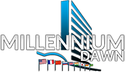

 

With the dawn of a new millennium, a new chapter in human history will be written. Globalization continues to change the lives of countless billions while rising extremism is showing signs of igniting the fires of conflict. New powers begin to emerge, and not all believe their place in the global order, or that of some competitors is warranted. A struggle will soon begin, and it will likely change everything. Will you lead your Nation to prosperity and dominance in the decades ahead, or will your Nation fall victim to the defining moments of history?

**Welcome to Millennium Dawn.**

Millennium Dawn is a multi-mod project set in the year 2000 and carries forward to the modern day. The mod boasts new and unique tech trees, focus trees, events, and decisions to immerse you in the intricacies of the modern era.

Further, it offers a new and unique economic system, a new political system, national taxation and debt, custom internal political factions, international influence mechanics, custom 3D models, a custom soundtrack, and much more!

## Welcome to the Millennium Dawn Wiki!

**The following Wiki is currently a work in progress. However, we will do our best to get meaningful content updated and placed on this page.**

### Joining the Millennium Dawn Development Team

The development team requires that you are at least 16 years of age and own a legitimate copy of Hearts of Iron IV. Furthermore, you have to have some degree of access to our discord to coordinate efforts with us and other developers. We are always looking for new playtesters, developers, and more. Translation on any of our various translation progress is independent of the main team structure and is conducted through Paratranz. Links for the respect language and their project can be found below. More information including the forms can be found on our discord in the [how-to-join-the-team](https://discord.com/channels/210890013334831104/764514951019757579) channel.

**Paratranz Projects**

- [Brazilian Portuguese](https://paratranz.cn/projects/10699)
- [Korean](https://paratranz.cn/projects/3830)
- [Traditional Chinese](https://paratranz.cn/projects/6617)
- [French](https://paratranz.cn/projects/10492)
- [Spanish](https://paratranz.cn/projects/10688)
- [Russian](https://paratranz.cn/projects/10514)
- [Japanese](https://paratranz.cn/projects/3949)
- [Simplified Chinese](https://paratranz.cn/projects/7367/)
- [Polish](https://paratranz.cn/projects/10795)
- [German](https://paratranz.cn/projects/10879)
- [Ukrainian](https://paratranz.cn/projects/11577)
- [Turkish](https://paratranz.cn/projects/10792)

### Tutorials

- [Economy Tutorial](/Millennium-Dawn/player-tutorials/economy-tutorial)
- [European Union Tutorial](/Millennium-Dawn/player-tutorials/eu-tutorial)
- [Millennium Dawn Tutorials](https://www.youtube.com/watch?v=9G6lYnP0knI&list=PL36TqZI0G592x3sYphwPHuMvobA6si543)
- [List of Playable Countries](https://gitlab.com/Millennium_Dawn/Millennium_Dawn/-/wikis/List-of-Countries)

### Developer/Team Resources

- [Knowledge Based Resources](/Millennium-Dawn/dev-resources/knowledge-based-resources)
- [MD Code Resource](/Millennium-Dawn/dev-resources/code-resource)
- [How to get setup with Gitlab & Github](https://docs.google.com/document/d/1V8DLowqEOSmlgazlHeC-hLZzLki5e6cWhQO_ZK6HVYs/edit?usp=sharing)
- [Politics list](https://docs.google.com/spreadsheets/d/1nv8FgVKC5xVwZyKaFjXsqF37P8LyKU8UvzxFkZnnT_o/edit?usp=sharing)
- [Help! I get an "Authentication failed" error when trying to clone the repo!](/Millennium-Dawn/dev-resources/authentication-failed-cloning-repo)

### Open Source Resources

- [Focus Tree Tool](/Millennium-Dawn/dev-resources/focus-tree-tool)
- [Localization Tool](/Millennium-Dawn/dev-resources/localization-tool)
- [Logging Tool](/Millennium-Dawn/dev-resources/logging-tool)

## **Credits**

A full list of credits for all of the models that are currently in use in-game: [Model Credit List](https://docs.google.com/spreadsheets/d/1ogWBBn-qooyQnjh-Tztnb2GDYhjCbAOtq_hpgwWDp58/edit#gid=0)

Special thanks to Cyrus Jackson for sharing his models and [Cold War: Iron Curtain](https://steamcommunity.com/sharedfiles/filedetails/?id=1458561226).

Furthermore, a non-exhaustive list can be found here at at the [Authors](misc/authors)
